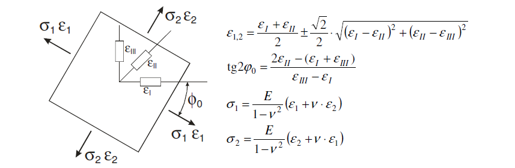

# Laboratorium 3: obliczenia numeryczne w języku Python

Określenia stanu naprężenia elementów konstrukcji nośnej można dokonać za pomocą pomiarów tensometrycznych. W tym celu należy w wybranych punktach konstrukcji nakleić rozety tensometryczne składające się z trzech czujników nachylonych do siebie pod kątem α = π/4 [rad]. W wyniku obciążenia konstrukcja, a wraz z nią czujniki tensometryczne ulegną odkształceniu. Wydłużenia względne na kierunkach poszczególnych czujników oznaczono jako εI, εII, εIII.

Na tym laboratorium, napiszesz skrypt w języku Python, który przetwarza dane pomiarowe z rozet tensometrycznych i wyznacza kierunki główne naprężeń, wartości naprężeń głównych σ₁, σ₂ oraz wartości odkształceń w tych kierunkach ε₁ i ε₂.

**Do zaliczenia laboratorium, konieczne jest przesłanie skryptu w formacie .py zawierającego informacje o kierunkach naprężeń głównych oraz ich wartościach oraz odkształceniach.**

---

## Dane pomiarowe

Pomiary przeprowadzono w 3 wybranych punktach konstrukcji. Dane zapisano w pliku `strain_measurements.csv`. Wyniki pomiarów są następujące:

| Lp. | εI [×10⁻⁴] | εII [×10⁻⁴] | εIII [×10⁻⁴] |
|-----|------------|-------------|--------------|
| 1   | 4.3        | 2.5         | 3.1          |
| 2   | 7.7        | 3.2         | 3.5          |
| 3   | 5.5        | 2.8         | 6.4          |

**Stałe materiałowe dla stali:**
- ν = 0.3 (współczynnik Poissona)
- E = 2.1×10⁵ MPa (moduł Younga)
- σ_dop = 220 MPa (naprężenie dopuszczalne)

---

## Wzory obliczeniowe

Wykorzystując zamieszczone poniżej zależności, wyznacz kierunki główne naprężeń φ₀, wartości naprężeń głównych σ₁, σ₂ oraz wartości odkształceń w tych kierunkach ε₁ i ε₂:



---

## Zadanie

Napisz skrypt w języku Python, który:

1. Wczytuje dane z pliku `strain_measurements.csv`
2. Dla każdego punktu pomiarowego oblicza:
   - Kąt kierunku głównego φ₀ [rad]
   - Odkształcenia główne ε₁ i ε₂
   - Naprężenia główne σ₁ i σ₂ [MPa]
3. Waliduje dane wejściowe i zgłasza `ValueError` w przypadku nieprawidłowych wartości
4. Porównuje obliczone naprężenia z naprężeniem dopuszczalnym σ_dop i wyświetla ostrzeżenie, jeśli wartość została przekroczona
5. Wyświetla wyniki w czytelnej formie w konsoli

**Przykład oczekiwanego wyjścia:**

```
=== Punkt pomiarowy 1 ===
εI = 4.30e-04, εII = 2.50e-04, εIII = 3.10e-04
φ₀ = 0.123 rad (7.05°)
ε₁ = 4.50e-04, ε₂ = 2.30e-04
σ₁ = 123.45 MPa, σ₂ = 67.89 MPa
Status: OK

=== Punkt pomiarowy 2 ===
εI = 7.70e-04, εII = 3.20e-04, εIII = 3.50e-04
φ₀ = -0.234 rad (-13.41°)
ε₁ = 8.15e-04, ε₂ = 2.75e-04
σ₁ = 234.56 MPa, σ₂ = 89.12 MPa
⚠ UWAGA: σ₁ przekracza naprężenie dopuszczalne (220 MPa)!

=== Punkt pomiarowy 3 ===
...
```

---

## Wskazówka

Rozważ dekompozycję problemu na mniejsze funkcje, np.:
- Funkcja do wczytywania danych z CSV
- Funkcja do obliczania kąta φ₀
- Funkcja do obliczania odkształceń głównych ε₁, ε₂
- Funkcja do obliczania naprężeń głównych σ₁, σ₂
- Funkcja do wyświetlania wyników

Możesz wykorzystać biblioteki takie jak `numpy` do obliczeń numerycznych oraz `pandas` do wczytywania danych.

